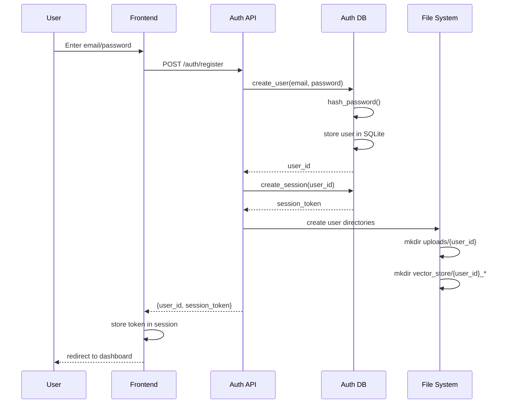
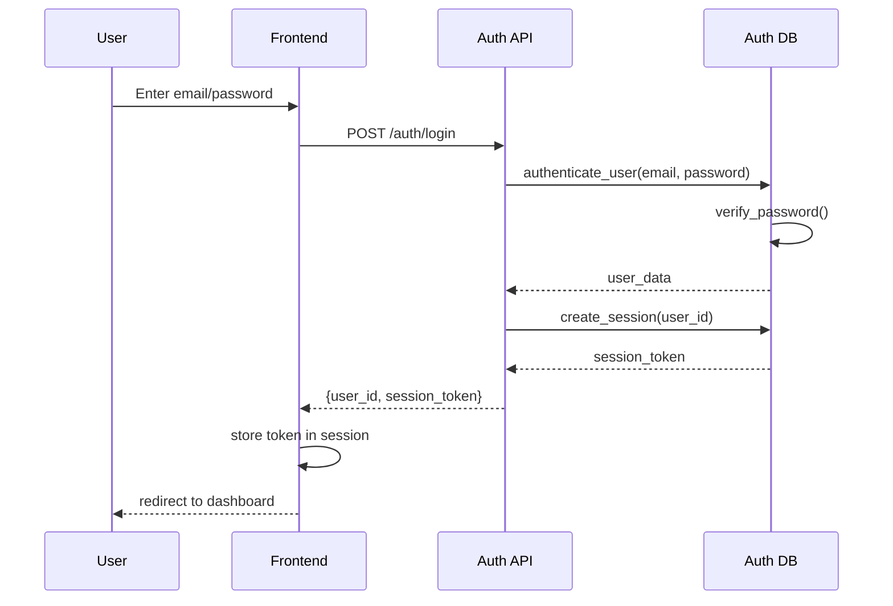
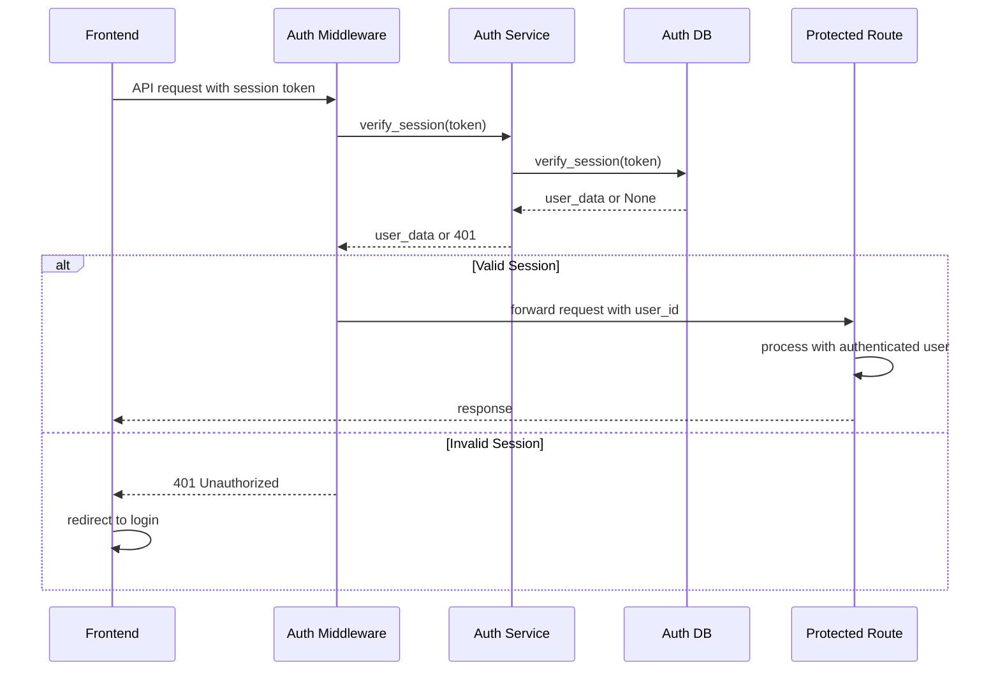

# Design Document: User Authentication

## Overview

The user authentication system for InStudy 2.0 provides secure, local authentication using SQLite database with bcrypt-style password hashing. The system implements email/password authentication with persistent sessions, replacing the current hardcoded "demo_user" approach. The design integrates seamlessly with the existing FastAPI backend and Streamlit frontend, providing folder-based data isolation where each authenticated user gets their own uploads/{user_id}/ and vector_store/{user_id}_{course}/ directories.

The authentication system follows a login-first UI pattern with session-based persistence, ensuring users remain logged in across browser sessions. All API endpoints will be secured with authentication middleware, and the frontend will include authentication guards to protect routes and display appropriate login/signup interfaces.

## Architecture

```mermaid
graph TD
    A[Streamlit Frontend] --> B[Authentication Middleware]
    B --> C[FastAPI Backend]
    C --> D[Auth Service Layer]
    D --> E[Auth Database Layer]
    E --> F[SQLite Database]
    
    C --> G[Protected API Routes]
    G --> H[Document Service]
    G --> I[Chat Service]
    G --> J[Quiz Service]
    G --> K[Other Services]
    
    H --> L[User File System]
    L --> M[uploads/{user_id}/]
    L --> N[vector_store/{user_id}_{course}/]
    
    subgraph "Authentication Flow"
        O[Login/Signup] --> P[Session Token]
        P --> Q[Cookie Storage]
        Q --> R[Request Headers]
    end
```

## Sequence Diagrams

### User Registration Flow



### User Login Flow



### Protected API Request Flow



## Components and Interfaces

### Component 1: Authentication Database Layer

**Purpose**: Handles all database operations for user management and session storage

**Interface**:
```python
class AuthDatabase:
    def create_user(self, email: str, password: str) -> Optional[int]
    def authenticate_user(self, email: str, password: str) -> Optional[Dict[str, Any]]
    def create_session(self, user_id: int, expires_days: int = 30) -> str
    def verify_session(self, token: str) -> Optional[Dict[str, Any]]
    def delete_session(self, token: str) -> bool
    def cleanup_expired_sessions(self) -> None
    def get_user_by_id(self, user_id: int) -> Optional[Dict[str, Any]]
```

**Responsibilities**:
- User account creation and validation
- Password hashing and verification using PBKDF2
- Session token generation and management
- Database schema initialization and maintenance

### Component 2: Authentication Service Layer

**Purpose**: Business logic layer that orchestrates authentication operations

**Interface**:
```python
class AuthService:
    def register_user(self, email: str, password: str) -> AuthResult
    def login_user(self, email: str, password: str) -> AuthResult
    def logout_user(self, token: str) -> bool
    def get_current_user(self, token: str) -> Optional[User]
    def create_user_directories(self, user_id: int) -> bool
    def validate_email(self, email: str) -> bool
    def validate_password(self, password: str) -> bool
```

**Responsibilities**:
- Input validation and sanitization
- User directory creation for file isolation
- Authentication result formatting
- Business rule enforcement

### Component 3: Authentication Middleware

**Purpose**: FastAPI middleware that protects routes and injects user context

**Interface**:
```python
class AuthMiddleware:
    def __call__(self, request: Request, call_next: Callable) -> Response
    def extract_token(self, request: Request) -> Optional[str]
    def verify_protected_route(self, path: str) -> bool
```

**Responsibilities**:
- Token extraction from requests
- Route protection based on configuration
- User context injection into request state
- Automatic redirect handling for unauthorized requests

### Component 4: Frontend Authentication Manager

**Purpose**: Streamlit component that manages authentication state and UI

**Interface**:
```python
class AuthManager:
    def show_login_form(self) -> None
    def show_signup_form(self) -> None
    def handle_login(self, email: str, password: str) -> bool
    def handle_signup(self, email: str, password: str) -> bool
    def logout(self) -> None
    def is_authenticated(self) -> bool
    def get_current_user(self) -> Optional[User]
```

**Responsibilities**:
- Authentication form rendering
- Session state management
- API communication for auth operations
- Route protection and redirects

## Data Models

### Model 1: User

```python
class User(BaseModel):
    id: int
    email: str
    created_at: datetime
    last_login: Optional[datetime]
```

**Validation Rules**:
- Email must be valid format and unique
- Email is case-insensitive and trimmed
- ID is auto-generated integer primary key

### Model 2: Session

```python
class Session(BaseModel):
    token: str
    user_id: int
    created_at: datetime
    expires_at: datetime
```

**Validation Rules**:
- Token is 32-byte URL-safe random string
- Expires_at must be future timestamp
- User_id must reference existing user

### Model 3: AuthResult

```python
class AuthResult(BaseModel):
    success: bool
    user_id: Optional[int]
    session_token: Optional[str]
    error_message: Optional[str]
```

**Validation Rules**:
- Success determines presence of user_id and session_token
- Error_message required when success is False

### Model 4: LoginRequest

```python
class LoginRequest(BaseModel):
    email: str
    password: str
```

**Validation Rules**:
- Email must be valid format
- Password minimum 8 characters
- Both fields required and non-empty

### Model 5: RegisterRequest

```python
class RegisterRequest(BaseModel):
    email: str
    password: str
    confirm_password: str
```

**Validation Rules**:
- Email must be valid format and not already registered
- Password minimum 8 characters with complexity requirements
- Confirm_password must match password

## Algorithmic Pseudocode

### Main Authentication Algorithm

```pascal
ALGORITHM authenticateUser(email, password)
INPUT: email of type String, password of type String
OUTPUT: result of type AuthResult

BEGIN
  ASSERT validateEmail(email) = true
  ASSERT validatePassword(password) = true
  
  // Step 1: Normalize and validate input
  normalizedEmail ← email.toLowerCase().trim()
  
  // Step 2: Authenticate against database
  user ← database.authenticateUser(normalizedEmail, password)
  
  IF user = null THEN
    RETURN AuthResult{success: false, error: "Invalid credentials"}
  END IF
  
  // Step 3: Create session with 30-day expiry
  sessionToken ← database.createSession(user.id, 30)
  
  IF sessionToken = null THEN
    RETURN AuthResult{success: false, error: "Session creation failed"}
  END IF
  
  // Step 4: Update last login timestamp
  database.updateLastLogin(user.id)
  
  ASSERT sessionToken ≠ null AND sessionToken.length = 43
  
  RETURN AuthResult{
    success: true,
    user_id: user.id,
    session_token: sessionToken
  }
END
```

**Preconditions**:
- email is non-null and non-empty string
- password is non-null and non-empty string
- database connection is available

**Postconditions**:
- Returns valid AuthResult object
- If successful: session token is created and stored
- If failed: appropriate error message is provided
- User's last_login is updated on successful authentication

**Loop Invariants**: N/A (no loops in main algorithm)

### User Registration Algorithm

```pascal
ALGORITHM registerUser(email, password, confirmPassword)
INPUT: email, password, confirmPassword of type String
OUTPUT: result of type AuthResult

BEGIN
  ASSERT validateEmail(email) = true
  ASSERT validatePassword(password) = true
  ASSERT password = confirmPassword
  
  // Step 1: Validate input
  normalizedEmail ← email.toLowerCase().trim()
  
  IF database.userExists(normalizedEmail) THEN
    RETURN AuthResult{success: false, error: "User already exists"}
  END IF
  
  // Step 2: Create user account
  userId ← database.createUser(normalizedEmail, password)
  
  IF userId = null THEN
    RETURN AuthResult{success: false, error: "Registration failed"}
  END IF
  
  // Step 3: Create initial session
  sessionToken ← database.createSession(userId, 30)
  
  // Step 4: Create user directories
  createUserDirectories(userId)
  
  ASSERT userId > 0 AND sessionToken ≠ null
  
  RETURN AuthResult{
    success: true,
    user_id: userId,
    session_token: sessionToken
  }
END
```

**Preconditions**:
- All input parameters are non-null strings
- password equals confirmPassword
- email passes validation rules
- password meets complexity requirements

**Postconditions**:
- User account is created in database
- User directories are created in file system
- Session token is generated and returned
- Returns success result with user_id and session_token

**Loop Invariants**: N/A (no loops in registration algorithm)

### Session Verification Algorithm

```pascal
ALGORITHM verifySession(token)
INPUT: token of type String
OUTPUT: user of type Optional[User]

BEGIN
  IF token = null OR token = "" THEN
    RETURN null
  END IF
  
  // Step 1: Query database for valid session
  sessionData ← database.verifySession(token)
  
  IF sessionData = null THEN
    RETURN null
  END IF
  
  // Step 2: Check expiration (database query includes expiry check)
  ASSERT sessionData.expires_at > currentTimestamp()
  
  // Step 3: Return user information
  user ← User{
    id: sessionData.user_id,
    email: sessionData.email
  }
  
  ASSERT user.id > 0 AND user.email ≠ ""
  
  RETURN user
END
```

**Preconditions**:
- token parameter is provided (may be null/empty)
- database connection is available

**Postconditions**:
- Returns User object if session is valid and not expired
- Returns null if session is invalid, expired, or token is empty
- No side effects on database state

**Loop Invariants**: N/A (no loops in verification algorithm)

### Directory Creation Algorithm

```pascal
ALGORITHM createUserDirectories(userId)
INPUT: userId of type Integer
OUTPUT: success of type Boolean

BEGIN
  ASSERT userId > 0
  
  // Step 1: Create base upload directory
  uploadPath ← "backend/uploads/" + toString(userId)
  
  IF NOT createDirectory(uploadPath) THEN
    RETURN false
  END IF
  
  // Step 2: Set directory permissions (read/write for owner only)
  setDirectoryPermissions(uploadPath, "700")
  
  // Step 3: Create vector store base (courses will be added dynamically)
  vectorBasePath ← "backend/vector_store"
  
  IF NOT directoryExists(vectorBasePath) THEN
    createDirectory(vectorBasePath)
  END IF
  
  ASSERT directoryExists(uploadPath)
  ASSERT directoryExists(vectorBasePath)
  
  RETURN true
END
```

**Preconditions**:
- userId is positive integer
- File system is writable
- Parent directories exist

**Postconditions**:
- User upload directory exists with proper permissions
- Vector store base directory exists
- Returns true if all operations successful
- Directory structure ready for user file operations

**Loop Invariants**: N/A (no loops in directory creation)

## Key Functions with Formal Specifications

### Function 1: hash_password()

```python
def hash_password(password: str) -> str
```

**Preconditions:**
- `password` is non-null and non-empty string
- `password` length >= 8 characters

**Postconditions:**
- Returns string of length 96 (32 char salt + 64 char hash)
- Hash is deterministic for same password and salt
- Salt is cryptographically random
- Uses PBKDF2 with SHA-256 and 100,000 iterations

**Loop Invariants:** N/A (uses library function)

### Function 2: verify_password()

```python
def verify_password(password: str, stored_hash: str) -> bool
```

**Preconditions:**
- `password` is non-null string
- `stored_hash` is 96-character string from hash_password()

**Postconditions:**
- Returns boolean indicating password match
- `true` if and only if password generates same hash
- No mutations to input parameters
- Constant-time comparison to prevent timing attacks

**Loop Invariants:** N/A (uses library function)

### Function 3: create_session()

```python
def create_session(user_id: int, expires_days: int = 30) -> str
```

**Preconditions:**
- `user_id` is positive integer referencing existing user
- `expires_days` is positive integer <= 365

**Postconditions:**
- Returns 43-character URL-safe token string
- Token is cryptographically random and unique
- Session record stored in database with expiration
- Token can be used for authentication until expiry

**Loop Invariants:** N/A (single database operation)

### Function 4: verify_session()

```python
def verify_session(token: str) -> Optional[Dict[str, Any]]
```

**Preconditions:**
- `token` parameter is provided (may be empty/invalid)

**Postconditions:**
- Returns user data dict if token valid and not expired
- Returns None if token invalid, expired, or not found
- No side effects on database state
- Includes automatic cleanup of expired sessions

**Loop Invariants:** N/A (single database query)

## Example Usage

```python
# Example 1: User Registration
auth_service = AuthService()
result = auth_service.register_user("user@example.com", "securepass123")

if result.success:
    print(f"User registered with ID: {result.user_id}")
    # Store session token in frontend
    session_token = result.session_token
else:
    print(f"Registration failed: {result.error_message}")

# Example 2: User Login
result = auth_service.login_user("user@example.com", "securepass123")

if result.success:
    print(f"Login successful for user: {result.user_id}")
    # Store session token for subsequent requests
    session_token = result.session_token
else:
    print(f"Login failed: {result.error_message}")

# Example 3: Protected API Request
@app.get("/api/documents/list")
async def list_documents(current_user: User = Depends(get_current_user)):
    user_id = current_user.id
    documents = get_user_documents(user_id)
    return {"documents": documents}

# Example 4: Frontend Authentication Check
def show_dashboard():
    if not auth_manager.is_authenticated():
        auth_manager.show_login_form()
        return
    
    user = auth_manager.get_current_user()
    st.write(f"Welcome, {user.email}!")
    # Show dashboard content
```

## Correctness Properties

The authentication system must satisfy these universal properties:

**Property 1: Authentication Integrity**
```python
∀ email, password: authenticate_user(email, password).success = true 
⟹ ∃ user ∈ database: user.email = email ∧ verify_password(password, user.password_hash) = true
```

**Property 2: Session Validity**
```python
∀ token: verify_session(token) ≠ null 
⟹ ∃ session ∈ database: session.token = token ∧ session.expires_at > current_time()
```

**Property 3: Password Security**
```python
∀ password1, password2: password1 ≠ password2 
⟹ hash_password(password1) ≠ hash_password(password2) (with high probability)
```

**Property 4: User Isolation**
```python
∀ user1, user2: user1.id ≠ user2.id 
⟹ user1.upload_directory ∩ user2.upload_directory = ∅
```

**Property 5: Session Uniqueness**
```python
∀ session1, session2: session1 ≠ session2 
⟹ session1.token ≠ session2.token
```

## Error Handling

### Error Scenario 1: Invalid Credentials

**Condition**: User provides incorrect email or password during login
**Response**: Return AuthResult with success=false and generic error message
**Recovery**: Allow user to retry with correct credentials or reset password

### Error Scenario 2: Duplicate Registration

**Condition**: User attempts to register with existing email address
**Response**: Return registration failure with "User already exists" message
**Recovery**: Redirect to login form or password reset flow

### Error Scenario 3: Expired Session

**Condition**: User makes API request with expired session token
**Response**: Return 401 Unauthorized status
**Recovery**: Frontend redirects to login page and clears stored token

### Error Scenario 4: Database Connection Failure

**Condition**: Database becomes unavailable during authentication operations
**Response**: Return 503 Service Unavailable with retry-after header
**Recovery**: Implement exponential backoff retry mechanism

### Error Scenario 5: File System Permission Error

**Condition**: Cannot create user directories due to permission issues
**Response**: Log error and return registration failure
**Recovery**: Admin intervention required to fix file system permissions

## Testing Strategy

### Unit Testing Approach

Test all authentication components in isolation using pytest framework:
- Database operations with in-memory SQLite
- Password hashing and verification functions
- Session token generation and validation
- Input validation and sanitization
- Error handling for all failure scenarios

**Coverage Goals**: 95% line coverage, 100% branch coverage for critical paths

### Property-Based Testing Approach

Use Hypothesis library to generate test cases that verify correctness properties:

**Property Test Library**: Hypothesis (Python)

**Key Properties to Test**:
- Password hashing is deterministic and collision-resistant
- Session tokens are unique and unpredictable
- Authentication is consistent (same credentials always produce same result)
- User isolation is maintained across all operations

### Integration Testing Approach

Test complete authentication flows using FastAPI TestClient:
- Full registration → login → protected request → logout cycle
- Session persistence across multiple requests
- Middleware integration with all protected routes
- Frontend authentication state management
- File system isolation verification

## Performance Considerations

**Password Hashing**: PBKDF2 with 100,000 iterations provides security while maintaining reasonable response times (<100ms on modern hardware)

**Session Storage**: SQLite with indexed token lookups ensures O(log n) session verification performance

**Database Connection Pooling**: Use connection pooling to handle concurrent authentication requests efficiently

**Token Size**: 32-byte tokens provide 256 bits of entropy while remaining URL-safe and manageable

**Session Cleanup**: Implement background task to remove expired sessions, preventing database bloat

## Security Considerations

**Password Storage**: Never store plaintext passwords; use PBKDF2 with random salt and high iteration count

**Session Security**: Generate cryptographically secure random tokens; implement proper expiration and cleanup

**Input Validation**: Sanitize all user inputs to prevent SQL injection and XSS attacks

**Rate Limiting**: Implement login attempt rate limiting to prevent brute force attacks

**HTTPS Only**: Ensure all authentication endpoints use HTTPS in production

**Token Transmission**: Send session tokens in HTTP-only cookies or secure headers, never in URLs

## Dependencies

**Backend Dependencies**:
- FastAPI: Web framework and dependency injection
- SQLite3: Database storage (built into Python)
- secrets: Cryptographically secure random number generation
- hashlib: PBKDF2 password hashing
- datetime: Session expiration handling

**Frontend Dependencies**:
- Streamlit: UI framework and session state management
- requests: HTTP client for API communication
- streamlit-option-menu: Navigation components

**Development Dependencies**:
- pytest: Unit testing framework
- hypothesis: Property-based testing
- httpx: Async HTTP client for integration tests